# Auditoria estatística das contagens — Eleições 2022

**Autor:** Flávio Mamede Pereira Gomes  
**Data:** 26 de setembro de 2026  
**Escopo:** 1º e 2º turnos da eleição presidencial; boletins de urna do TSE; modelo de urna por seção (logs TSE / projeto John Robson); coordenadas de locais (Hidalgo v0.16); polígonos municipais (geobr).  
**Referências metodológicas:** Cochran–Mantel–Haenszel; regressão ecológica (Goodman); Forsberg, *Understanding Elections through Statistics* (CRC, 2021), caps. 6–7.

---

## Sumário executivo

Este relatório separa com rigor **indício** e **prova**. Indício é distorção real e estatisticamente significativa relacionada ao fato; basta, *conforme queríamos demonstrar*, para afirmar que há o que investigar. Prova exige ainda destino discriminante (relação causal com a urna que sobrevive a controles) e, no limite, registro independente do software.

Há diferença agregada entre a proporção Lula/Bolsonaro nas urnas anteriores a 2020 e nas UE2020 — **indício real**. Nos **1.353 locais** com os dois modelos lado a lado, descontada a composição legislativa, o contraste cai a **+0,01 pp** (t = 0,13). Esse nível de comparação atribui o indício agregado, na maior parte, à **alocação** dos equipamentos — sem invalidar outros indícios obtidos por vias distintas (Forsberg).

Pelos critérios do Cap. 6 de Forsberg, há **associação estatística** entre taxa de brancos+nulos e apoio a Lula (coef. logit ≈ +0,35; z ≫ 2). Isso é *unfairness* possível e, na terminologia deste projeto, **é indício** do que pode ser fraude — não prova isolada. O sinal não é uniforme no país: é mais forte (z elevado, coeficiente positivo) em UFs como SP, RS, MS, PB, ES, PE; em outras (CE, PA, PR, PI…) o coeficiente inverte de sinal. Os resíduos desse modelo ainda têm Moran **I ≈ 0,57**: os desvios se agrupam no espaço (clusters HH significativos sobretudo em SP, BA, PE, PB).

Pelo Cap. 7, modelos espaciais baixam o coeficiente da fração de urnas antigas sobre a proporção de Lula de cerca de **+3,3 pp** (MQO) para **+1,4 pp** (erro espacial). Neutro, na escala do mesmo prédio, seria ≈ **+0,01 pp**. **+1,4 pp não é neutro**: permanece **indício** associado à urna/lugar após controle espacial global. Ainda não é prova nem indício discriminante a favor da fraude (falta a calibração F4a no domínio onde a referência é conhecida); mas tampouco se pode dizer que o Cap. 7 “zerou” o efeito.

**Conclusão para o leitor:** **há indícios** com significância estatística (Caps. 6 e 7, além do contraste agregado). **Não há prova** de fraude por modelo de urna. O azul do mapa de Lula continua sendo geografia do voto, não o teste de Forsberg.
---

## 1. Conceitos e fundamentos

### 1.1 Indício, indício discriminante e prova

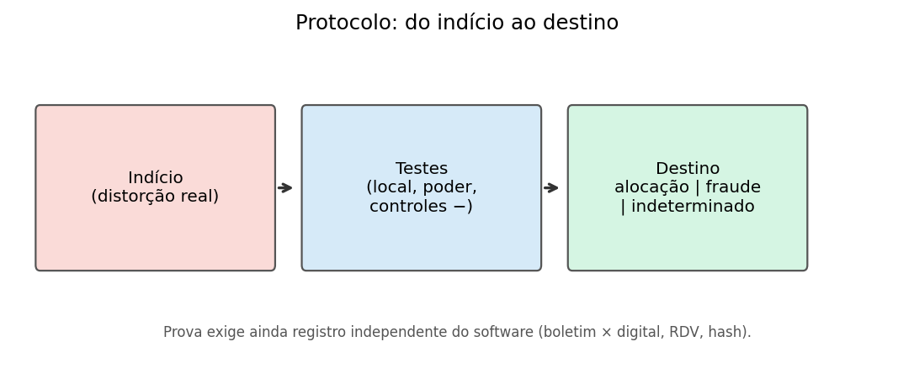

*Figura 1 — Do indício ao destino (protocolo de auditoria).*

Neste trabalho os termos seguem o sentido do direito brasileiro (CPP art. 239; CPPM arts. 382–383), e não o inglês *evidence*:

| Nível | Critério |
|-------|----------|
| **Indício** | Distorção real e significativa relacionada ao fato |
| **Indício discriminante** | A relação causal com a urna sobrevive ao teste de mesmo local, aos controles negativos e à confirmação |
| **Indício forte** | Discriminante e convergente com indícios independentes (carga, flashcard, fatores humanos) |
| **Prova** | Forte e coincidente com registro independente do software |
| **Exclusão de mecanismo** | Teste com poder ≥ 90% para fraude capaz de alterar o resultado, sem sinal |

Cada indício recebe um de três destinos: **atribuído à alocação**, **atribuído à fraude** ou **indeterminado**. Encontrar indício *do que pode ser fraude* (associação estatística compatível com unfairness ou com efeito residual de urna) **já satisfaz** o objetivo intermediário da auditoria — *conforme queríamos demonstrar* — sem confundir isso com prova.

### 1.2 Confundimento espacial (P0)

O modelo de urna não foi sorteado. As UE2020 concentram-se em capitais e municípios maiores; as antigas, no interior. Dentro das zonas, a alocação ainda corre por prédio de votação. Qualquer contraste bruto entre marcas mistura **lugar** e **equipamento**.

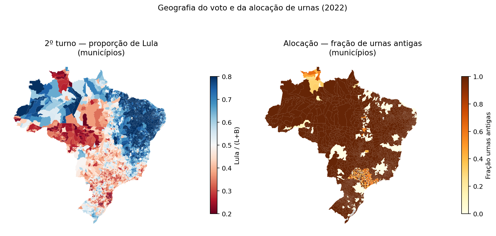

*Figura 2 — Geografia do voto (Lula, 2º turno) e da alocação (fração de urnas antigas), por município. Os dois mapas não são independentes.*

#### O azul do mapa é indício de fraude?

Não. No painel da esquerda, **azul escuro = município em que Lula teve maior fração dos votos válidos** entre Lula e Bolsonaro (escala ~20% a ~80%). Vermelho escuro = o contrário. A “quantidade visual de azul” é, portanto, a **geografia do eleitorado** no 2º turno — Norte e Nordeste votaram mais em Lula; Sul, parte do Sudeste e Centro-Oeste, mais em Bolsonaro. Isso é o resultado oficial agregado no mapa; não é um teste de integridade da urna.

O que o par de mapas *mostra* de útil à auditoria é outra coisa: o painel da direita (marrom = quase só urnas antigas) cobre grande parte do território, inclusive onde o azul é dominante. Quem olha os dois juntos e conclui “azul = fraude nas antigas” comete o erro clássico de **confundimento**: lugar, perfil social e marca de urna caminham juntos. O Cap. 7 de Forsberg existe precisamente para obrigar o analista a modelar essa dependência espacial em vez de ler cor como prova.

### 1.3 Taxas de transferência e scores

A ideia por trás dos scores do VotoReal é uma **tabela de transferência**: dado o voto em deputado (ou partido), que fração “iria” a Bolsonaro ou a Lula. A calibragem objetiva estima essas taxas por regressão ecológica restrita **somente nas seções UE2020** de cada UF e aplica a mesma tabela às seções com urna antiga. O erro relativo resultante mede desajuste de domínio — não, por si, fraude.

### 1.4 Invalidação diferencial (Forsberg, cap. 6)

Sob a hipótese de eleição livre e justa, a taxa de brancos e nulos deve ser **independente** do apoio ao candidato. Relação significativa é *unfairness* possível e, neste relatório, **conta como indício** (do que pode ser fraude) — não como prova *per se*. Números, mapa por UF e clusters: **seção 6**.

### 1.5 Autocorrelação espacial (Forsberg, cap. 7)

Vizinhos votam parecido; a alocação de urnas também se agrupa no mapa. O Cap. 7 não “apaga” indícios: ele exige que o efeito estimado sob controle espacial seja lido contra uma referência neutra (no mesmo prédio, ≈ +0,01 pp). Detalhe na **seção 6**.
---

## 2. Dados e unidade de análise

| Fonte | Uso |
|-------|-----|
| Boletins de urna TSE (`bweb_*`) → base larga `secoes_2022_t{1,2}` | 472.028 seções; totais Lula/Bolsonaro batem com a referência oficial |
| Modelo de urna por seção (logs TSE / John Robson) | UE2020 (= Positivo) vs anteriores (= Diebold, em regra) |
| Hidalgo `geocode_br_polling_stations` v0.16 | Coordenadas de ~92,3 mil locais; 99,1% dentro do município IBGE |
| geobr municípios 2022 | Polígonos; validação ponto-no-polígono |

Unidades usadas neste relatório: **seção**, **local de votação** (prédio), **município**, **UF**.

---

## 3. Hierarquia de contrastes: o efeito encolhe

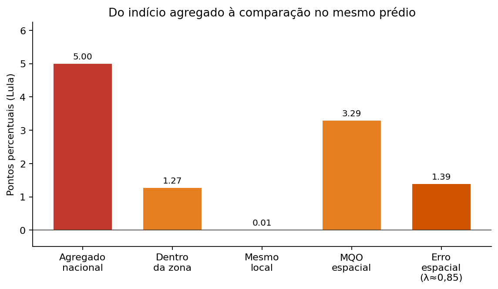

*Figura 5 — Efeito associado à urna antiga (pontos percentuais a favor de Lula) em sucessivos níveis de controle.*

| Nível | Efeito (pp) | Leitura |
|-------|------------:|---------|
| Dentro da zona (Brasil, sem covariáveis) | +1,27 (t = 5,4) | Indício I2 |
| Mesmo local + composição legislativa | **+0,01 (t = 0,13)** | Comparação no prédio |
| MQO espacial (locais, k=8) | +3,29 | Ainda mistura geografia |
| Erro espacial (λ ≈ 0,85) | +1,39 | Reduz, não chega a 0,01 |

A diferença entre +1,39 (erro espacial global) e +0,01 (mesmo local) mede o viés que resta quando se força um coeficiente único no país — limitação que Forsberg aponta e que GWR/SLEM tratam.

---

## 4. Proposições: o que ficou estabelecido ou refutado

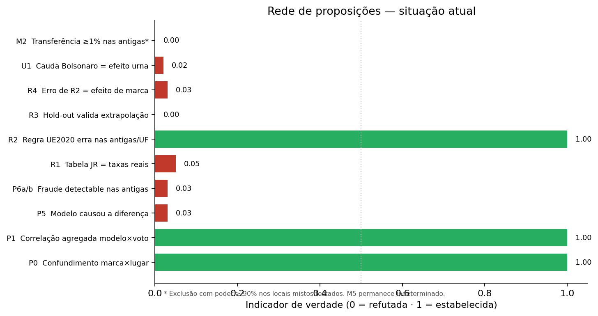

*Figura 6 — Indicadores de verdade (0 = refutada; 1 = estabelecida).*

### 4.1 Relatório CMH / modelo de urna

| Nº | Proposição | Indicador | Fundamento |
|----|------------|----------:|------------|
| P0 | Modelo de urna entrelaçado com localização e perfil | **1,00** | Premissa confirmada em todos os níveis |
| P1 | Há correlação agregada modelo × voto | **1,00** | R bruto ≈ 1,15–1,17 |
| P2 | Há diferença intrazonal nacional | **1,00** | +1,27 pp, t = 5,4 |
| P2a | Essa diferença é homogênea no país | **0,03** | Concentrada em SP |
| P3 | p-valores CMH por voto são válidos como reportados | **0,00** | Dispersão; a rejeição de H0 sobrevive com a seção |
| P4 | Dentro das zonas, alocação independe do perfil | **0,00** | Negação de P0 |
| P4′ | No mesmo local, seções antigas e UE2020 são comparáveis | **0,85** | Controles negativos equilibrados |
| P5 | O modelo de urna **causou** a diferença | **0,03** | Nulo no prédio, com poder para 1% |
| P6a/b | Fraude detectable (≥ 1%) nas antigas | **0,02–0,03** | Nulo no prédio (Brasil e SP) |
| P6c | Intrazonal aponta efeito das antigas no Nordeste | **0,02** | Sinal contrário / nulo |
| P7 | Evidência equivalente a tabagismo–câncer | **0,00** | Analogia inválida |
| P10 | A diferença inverte o resultado | **0,00** | Magnitude intramunicipal ≪ margem |

### 4.2 Scores VotoReal

| Nº | Proposição | Indicador | Fundamento |
|----|------------|----------:|------------|
| R1 | Tabela subjetiva JR = taxas reais | **0,05** | Afasta-se em PP, Republicanos, PSOL, NOVO… |
| R2 | Regra UE2020 por UF erra nas antigas da mesma UF | **1,00** | Erro relativo estável 1º↔2º turno |
| R3 | Hold-out 70/30 valida extrapolação às antigas | **0,00** | Valida só dentro das Positivo |
| R4 | Erro de R2 = efeito de marca | **0,03** | T1 grande com mesma marca; T2 ≈ 0 |

### 4.3 Cauda de votação mínima

| Nº | Proposição | Indicador |
|----|------------|----------:|
| U1 | Mínimos de Bolsonaro nas antigas por efeito do modelo | **0,02** |
| U2 | Nas 27 seções do AM sem Bolsonaro, o voto destoa dos demais cargos | **0,00** |

### 4.4 Mecanismos M1–M5

| Mecanismo | Situação |
|-----------|----------|
| M1 Manipulação após a urna (totalização) | **Excluída** (soma dos BUs = resultado oficial) |
| M2 Transferência específica das urnas antigas (≥ 1% nos testados) | **Excluída** com poder demonstrado |
| M3 Manipulação concentrada na escala da margem | **Excluída** |
| M4 Dispersa sem reconhecer teste de integridade | **Excluída** (prob. ≥ 99,6% no desenho do pacote) |
| M5 Dispersa, comum a todos os modelos, reconhecendo o teste | **Indeterminada** |
| D-ext Só em municípios sem comparação interna | **Em aberto** (análise geográfica) |

---

## 5. Calibragem dos scores e controles T1/T2/T3

### 5.1 Contraste Positivo → Diebold por UF

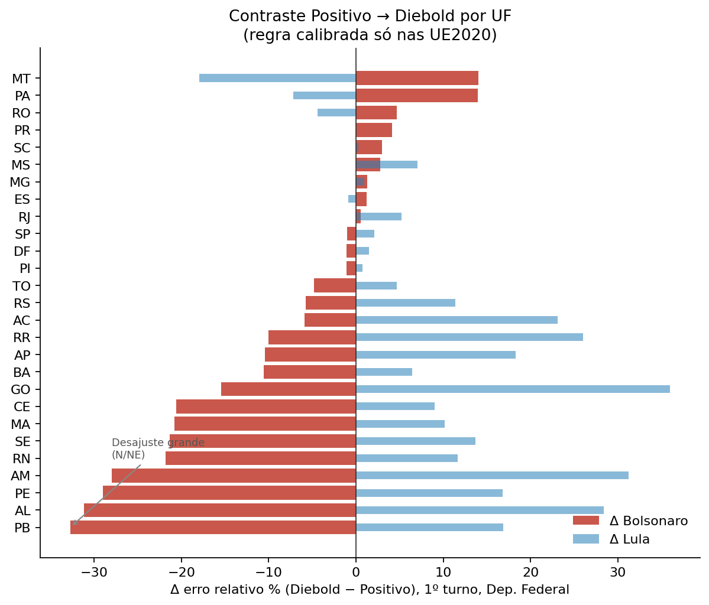

*Figura 7 — Δ de erro relativo (Diebold − Positivo) após calibrar nas UE2020. PB, AL, PE, AM, CE… ultrapassam 20–30% em Bolsonaro. SP, MG, DF ficam perto de zero.*

Atenção: nos estados de maior Δ, capital ≈ UE2020 e interior ≈ antigas. O Δ **mistura** capital/interior com eventual efeito de marca. Por isso os controles abaixo.

### 5.2 Scores subjetivos × calibrados

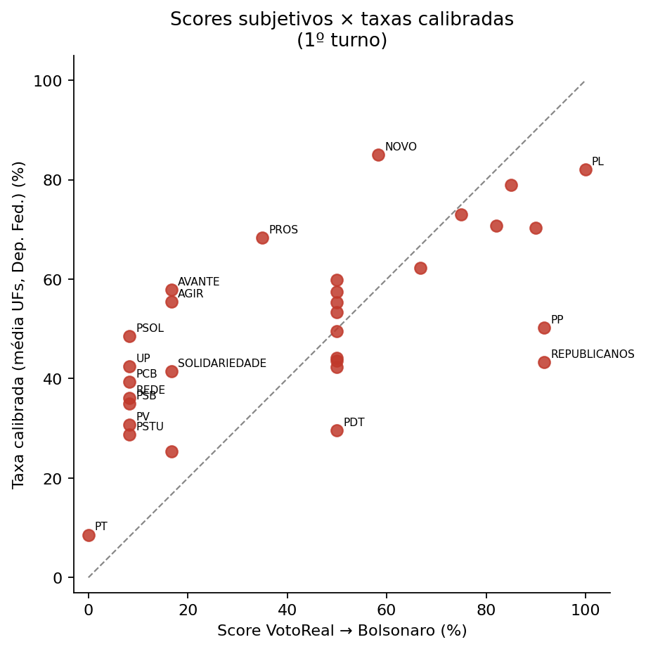

*Figura 8 — No eixo x, o score do site; no y, a taxa média calibrada (Dep. Federal, 1º turno). A diagonal é a concordância perfeita. PL e PT apontam o mesmo lado; PP, Republicanos, PSOL e NOVO afastam-se bastante.*

### 5.3 Controles: T1 grande, T2 colapsa

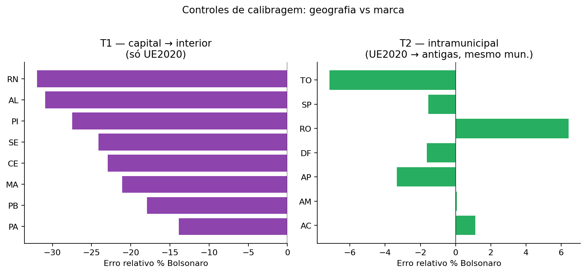

*Figura 9 — **T1** (UE2020 capital → UE2020 interior): erros relativos grandes no NE, *com a mesma marca*. **T2** (UE2020 → antigas no mesmo município, ≥30+30 seções): 165 municípios (155 em SP); erro médio ≈ −0,9%.*

Leitura alinhada a Forsberg e à crítica metodológica: o padrão favorece a hipótese **geográfica**. R4 (erro = marca) não se sustenta neste desenho.

---

## 6. Forsberg Caps. 6 e 7 — indícios com significância estatística

Alinhamento a Ole J. Forsberg, *Understanding Elections through Statistics*, caps. 6–7. Premissa desta seção: **indício ≠ prova**. Associação estatística compatível com unfairness ou com efeito residual de urna **é indício**; prova exigiria destino discriminante e, no limite, registro independente.

### 6.1 Cap. 6 — Invalidação diferencial: há indício

Pergunta do capítulo: a taxa de brancos e nulos é independente do apoio ao candidato? Se não, há *unfairness* possível (fraude na contagem, ou demografia, alfabetização, cédula…). No protocolo deste projeto, esse achado **é indício** do que pode ser fraude — suficiente para o *Q.E.D.* intermediário —, embora **não** seja prova isolada.

Resultados nacionais (F3, ~92 mil locais, 2º turno):

| Estatística | Valor | Significado |
|-------------|------:|-------------|
| Quasi-binomial `pInv ~ pSup` (pSup = fração Lula) | coef. logit ≈ **+0,35**; z ≫ 2 | Associação significativa: onde há mais Lula, há mais BN (em média nacional) |
| Mesmo modelo + fração urna antiga + interação | interação ≈ **−0,13** (z ≪ −2) | O indício **não** é idêntico onde há mais urnas antigas |
| **Moran I nos resíduos** do modelo `pInv ~ pSup (+ old)` | **I ≈ 0,57** (z ≈ 372) | Os erros do Cap. 6 **não são aleatórios no mapa**: locais com invalidação acima (ou abaixo) do previsto tendem a ter vizinhos no mesmo sentido. I perto de 0 seria ausência de agrupamento; I ≈ 0,57 é autocorrelação positiva forte |

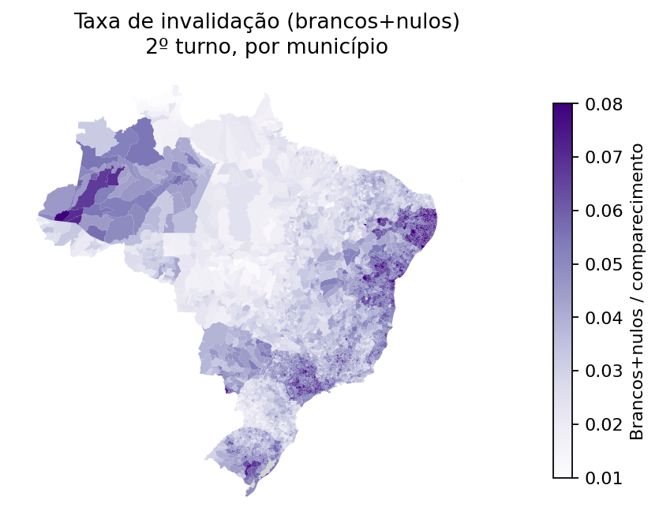

*Figura 10 — Taxa de brancos+nulos por município. Ponto de partida do Cap. 6.*

#### Onde o indício do Cap. 6 é maior

O coeficiente nacional esconde heterogeneidade. Reestimando por UF (`pInv ~ pSup + old`):

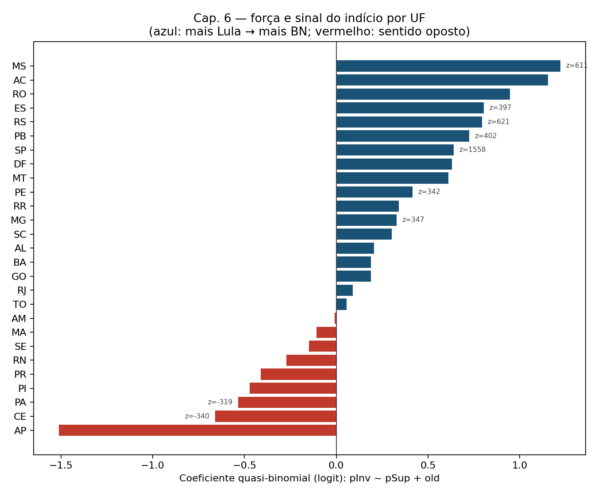

*Figura 11 — Coeficiente do apoio a Lula sobre a invalidação, por UF. Azul: sentido “mais Lula → mais BN” (mesmo sinal do nacional). Vermelho: sentido oposto. Rotulados os z mais extremos.*

UFs com indício **mais forte no sentido nacional** (coef. positivo e |z| elevado): **SP, RS, MS, PB, ES, MG, PE, MT, RO, DF, BA, AC** (entre outras). UFs em que o coeficiente **inverte** (mais Lula → menos BN, também com |z| alto): **CE, PA, PR, PI, AP, RN, MA, SE**. O indício existe nos dois casos — é a *dependência* entre invalidação e apoio que viola a independência do Cap. 6; o sinal diz *para que lado* a unfairness aparente aponta naquela UF.

Clusters LISA (p < 0,05) do tipo **HH** nos resíduos (invalidação **acima** do previsto pelo modelo nacional), por região:

| Região | Locais HH significativos | Observação |
|--------|-------------------------:|------------|
| Sudeste | 7.619 | Concentração grande em **SP** |
| Nordeste | 7.430 | **BA, PE, PB, AL** entre os maiores |
| Sul | 617 | Principalmente **RS** |
| Norte | 278 | Inclui **AM** |
| Centro-Oeste | 81 | Inclui **MS** |

No total, cerca de **17%** dos locais caem em cluster HH significativo. CSV: `geografia/.../resultados/di_espacial_por_uf.csv` e `di_espacial_lisa_HH_por_regiao.csv`.

### 6.2 Cap. 7 — Geografia: o efeito urna residual também é indício

O Cap. 7 confirma que voto, invalidação e alocação de urnas são espacialmente autocorrelacionados (Moran da proporção de Lula ≈ **0,85**; da fração de urnas antigas ≈ **0,87**). Por isso um MQO sem estrutura espacial infla o “efeito urna”.

| Especificação | Coef. fração urna antiga → % Lula | Leitura |
|---------------|----------------------------------:|---------|
| MQO (locais, k=8) | **+3,3 pp** | Indício bruto, muito confundido com lugar |
| Defasagem espacial (GM_Lag) | **+2,1 pp** | Cai, permanece longe de zero |
| Erro espacial (GM_Error_Het) | **+1,4 pp** | Cai de novo; **ainda ≠ neutro** |
| Mesmo local + composição legislativa (referência) | **+0,01 pp** (t = 0,13) | Referência neutra *onde há comparação interna* |

Sim: **+1,4 pp não é neutro**. Neutro, na escala que este projeto adotou no prédio, seria da ordem de **+0,01 pp**. O fato de os modelos espaciais globais **não** levarem o coeficiente a esse piso deixa de pé um **indício** — sinal estatístico ainda associado à fração de urnas antigas após controle espacial de coeficiente constante.

O que o Cap. 7 *ainda não* entrega, e por isso o indício **não** sobe sozinho a prova nem a indício discriminante “fraude”:

1. Calibração **F4a**: o mesmo modelo espacial, aplicado só onde a referência do prédio é ≈ 0, precisa reproduzir ≈ 0; se não reproduzir, o +1,4 pp no resto do mapa pode ser viés do modelo, não fraude.  
2. Efeitos que variam no mapa (SEM, GWR, SLEM).  
3. Domínio sem comparação interna (~44% dos votos) ainda em aberto.

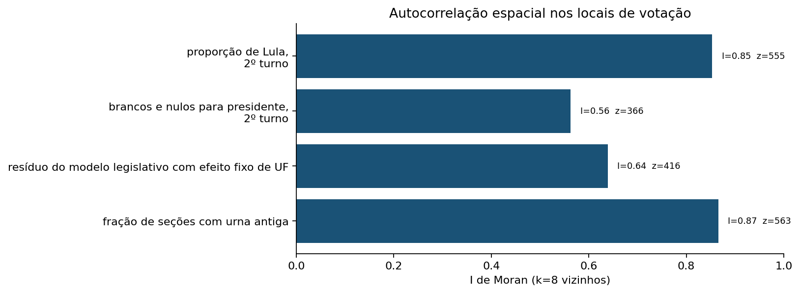

*Figura 12 — Moran global: por que o Cap. 7 é obrigatório.*

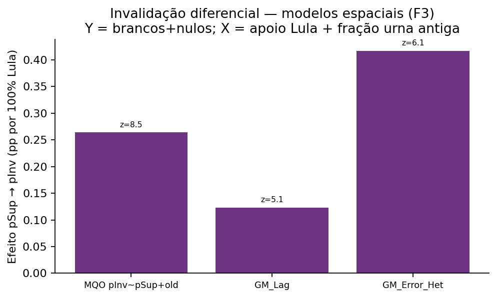

*Figura 13 — Cap. 6 sob especificações espaciais: a associação invalidação × apoio permanece significativa (z > 5).*

### 6.3 Síntese Caps. 6 e 7

| Achado | É indício? | É prova? |
|--------|:----------:|:--------:|
| Associação nacional BN × apoio a Lula (Cap. 6) | **Sim** | Não |
| Heterogeneidade por UF / clusters HH de resíduos | **Sim** (localiza o indício) | Não |
| Moran I ≈ 0,57 nos resíduos do Cap. 6 | **Sim** (o padrão é espacial) | Não — é diagnóstico de dependência |
| Coef. urna +1,4 pp após erro espacial (Cap. 7) | **Sim** (não é o neutro +0,01) | Não — falta F4a / efeitos variáveis |
| Azul no mapa de Lula | **Não** (é voto) | Não |
| Contraste urna no mesmo prédio ≈ 0 | Atribui o indício *agregado de marca* sobretudo à alocação | — |

### 6.4 Alcance além do prédio

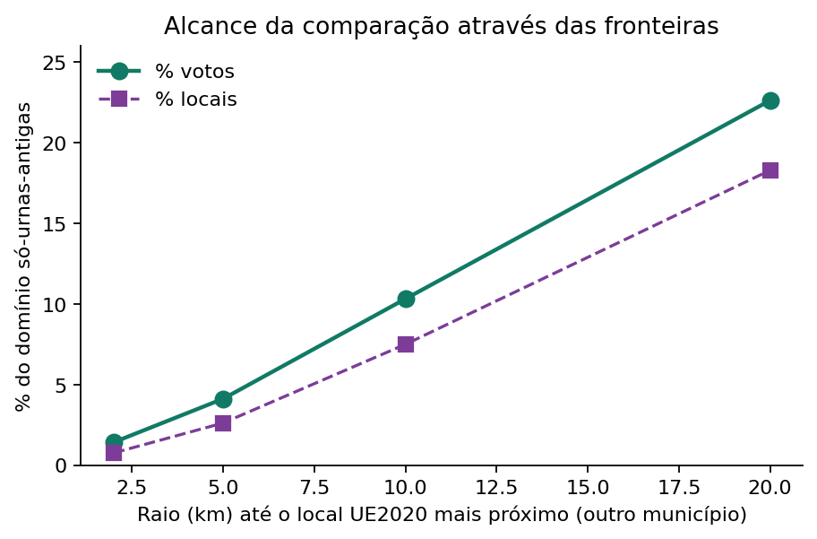

*Figura 14 — Fração do domínio só-urnas-antigas com UE2020 a ≤ r km noutro município.*

### 6.5 Próximas etapas

1. **F4a** — Calibrar o modelo espacial na referência do prédio.  
2. **F4b** — GWR e SLEM.  
3. **F4c** — Pares cross-border.  
4. **F4d** — Poder com fraudes sintéticas no domínio sem comparação interna.  
5. Controles demográficos sobre o indício do Cap. 6 nas UFs de maior |z|.

---

## 7. Indícios examinados e destino

| Indício | Distorção | Destino | Fundamento resumido |
|---------|-----------|---------|---------------------|
| I1 Agregado entre modelos | R ≈ 1,17 por estado | **Alocação** | R ≈ 1,05 no município; UE2020 nas capitais |
| I2 Dentro da zona | +1,27 pp | **Alocação** | Concentrado em SP; nulo no local |
| I3 Resíduo paulista entre prédios | +0,26 pp | **Alocação** | Nulo dentro do prédio |
| I4 Erro da calibragem por UF | 20–30%+ no N/NE | **Alocação** | Placebo T1 UE2020 capital→interior |
| I5 27 urnas AM sem Bolsonaro | Real | **Alocação / alinhamento** | Municípios só antigas; coerência com outros cargos |
| I6 PL alto / Bolsonaro baixo | Real | **Alinhamento local** | PL Senado fraco nas mesmas seções |
| I7 Mais BN nas antigas (zona) | +0,28 pp | **Alocação** (no local ≈ 0) | No local: −0,07 pp |
| I8 R intramunicipal RR | R = 1,77 | **A examinar** | Falta teste por local |
| **I9** Cap. 6 — BN × apoio a Lula | coef. ≈ +0,35; z ≫ 2; LISA HH ~17% | **Indício** (unfairness possível) | Não é prova; forte em SP, RS, MS, PB, PE… |
| **I10** Cap. 7 — coef. urna após erro espacial | **+1,4 pp** vs neutro **+0,01** | **Indício** (não neutro) | Não discriminante até F4a |

---

## 8. Resposta à pergunta do leitor

**“Há indício de fraude ou não?”**

**Há indícios** — no sentido deste relatório: distorções estatisticamente significativas compatíveis com unfairness (Cap. 6) e com efeito residual associado à fração de urnas antigas após controle espacial global (Cap. 7, +1,4 pp ≠ +0,01). Isso é o que queríamos poder afirmar quando o teste rejeita a independência ou a neutralidade.

**Não há prova** de fraude por modelo de urna. O contraste no mesmo prédio atribui o indício *agregado de marca* sobretudo à alocação; os indícios I9 e I10 permanecem com destino a aprofundar (demografia, F4a–F4d), sem serem apagados por essa atribuição.
---

## 9. Artefatos e reprodução

| Pasta / arquivo | Conteúdo |
|-----------------|----------|
| `2026/analise/relatorio_calibragem.md` | Calibragem de scores (corrigenda) |
| `2026/analise/relatorio_base_e_controles.md` | Base larga + T1/T2/T3 |
| `2026/geografia/claude_opus55_externo/docs/` | Docs 01–07 (CMH, protocolo, scores, limites, geo) |
| `2026/envio_calibragem_scores_johnrobson_2026-09-26.zip` | Pacote enviado para atualização do site |
| `2026/scripts/gerar_figuras_relatorio.py` | Figuras deste relatório |
| `2026/geografia/.../scripts/06_espacial.py`, `07_di_espacial.py` | Pipeline espacial |

Reprodução geográfica (resumo):

```bash
cd 2026/geografia/claude_opus55_externo/scripts
python3 00_baixar_dados.py
python3 06_espacial.py
python3 07_di_espacial.py
```

---

## 10. Limitações

1. O teste de mesmo local não cobre municípios só com um modelo (~44% dos votos).  
2. Coordenadas têm erro residual (mediana baixa; excluir `conf_dist_km` > 1 km em sensibilidade).  
3. GWR não tem teste nativo; SLEM depende da forma funcional.  
4. M5 é estruturalmente indeterminado com os registros públicos de 2022.  
5. Taxas calibradas não somam 1 em Bolsonaro+Lula (há “Outros”); o site, se atualizar scores, precisa decidir a renormação.

---

*Relatório gerado no projeto `PROJETO_ELEICOES_JOHNROBSON/2026`. Figuras em `relatorio/figuras/`.*
